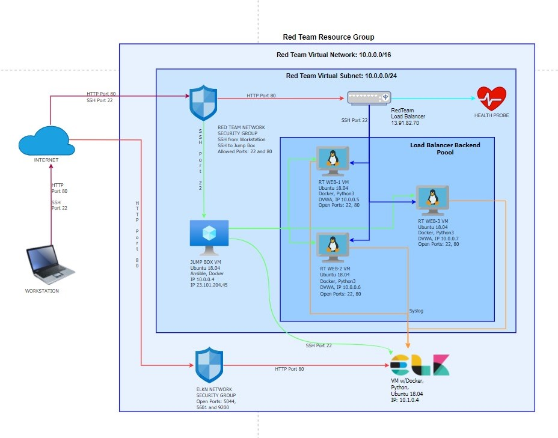
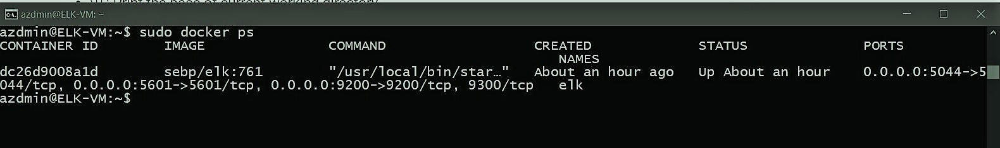
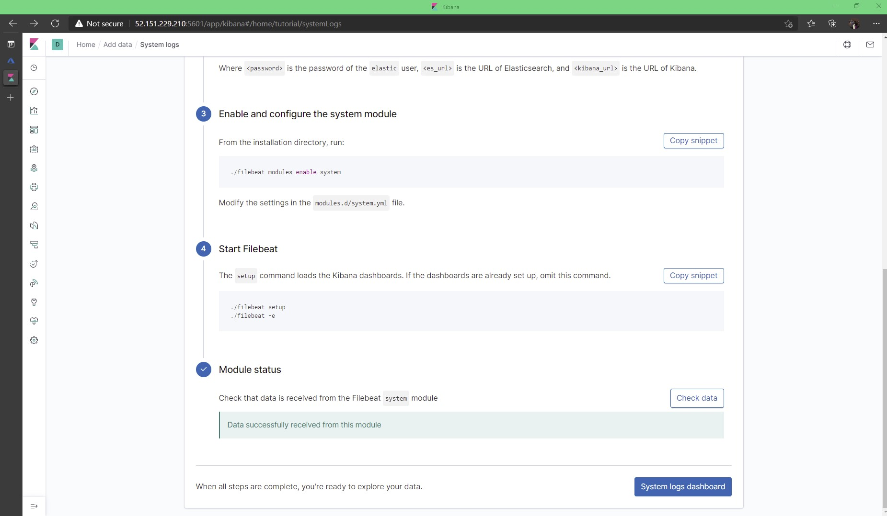
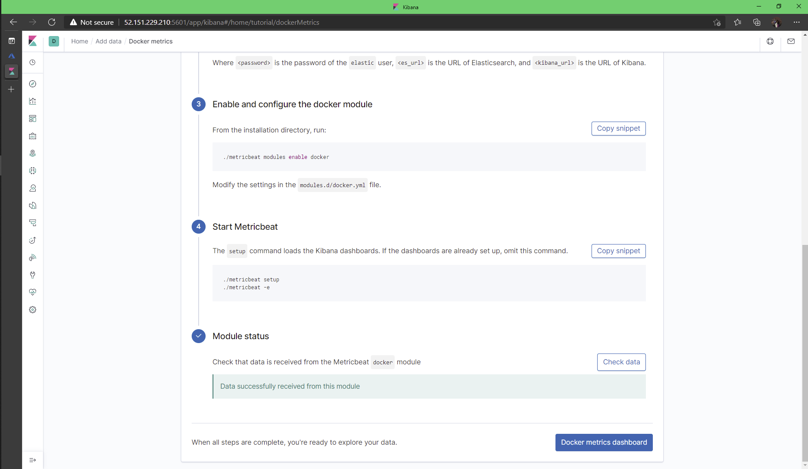
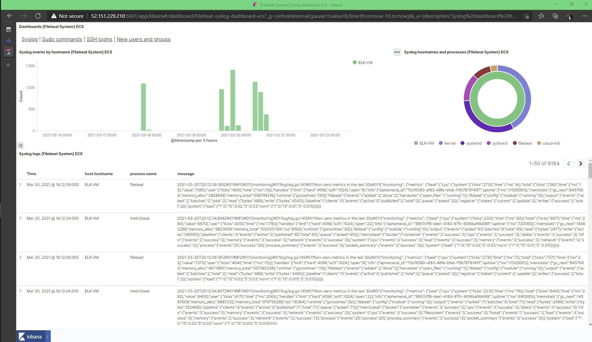
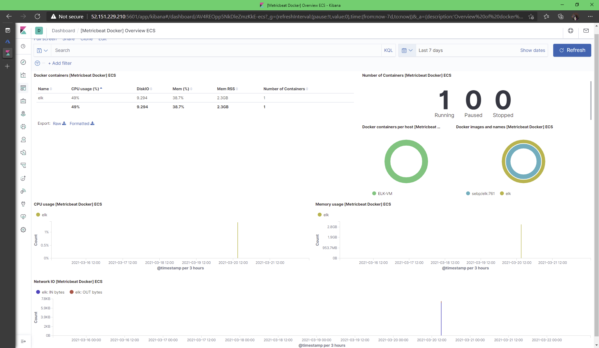

## Automated ELK Stack Deployment

The files in this repository were used to configure the network depicted below.

&nbsp;&nbsp;

These files have been tested and used to generate a live ELK deployment on Azure. They can be used to either recreate the entire deployment pictured above. Alternatively, select portions of the Playbook file may be used to install only certain pieces of it, such as Filebeat.

  - _ __filebeat-playbook.yml e filebeat-config.yml__

This document contains the following details:
- Description of the Topology
- Access Policies
- ELK Configuration
  - Beats in Use
  - Machines Being Monitored
- How to Use the Ansible Build

&nbsp;

### Description of the Topology

The main purpose of this network is to expose a load-balanced and monitored instance of DVWA, the D*mn Vulnerable Web Application.

Load balancing ensures that the application will be highly functional, in addition to restricting traffic to the network.
- Besides distributing traffic across servers, the load balancer performs DDoS mitigation by shifting attack traffic. 
- The jump box prevent the virtual machines from being exposed to the public, and its restrict access get the VM secured and easy to monitor.

Integrating an ELK server allows users to easily monitor the vulnerable VMs for changes to the jamp box and system network.
- The Filebeat monitors the log files or locations previous specified, collects log events, and forwards them either to Elasticsearch or Logstash for indexing._
- The Metricbeat periodically collect metrics/statistcs data from the operating system and from services running on the server.

The configuration details of each machine may be found below.

|    Name   	|   Function   	| IP Address 	| Operating System 	|
|:---------:	|:------------:	|:----------:	|:----------------:	|
| Jump Box  	|    Gateway   	|  10.0.0.4  	|       Linux      	|
| DVWA-VM1  	|  Web Server  	|  10.0.0.5  	|       Linux      	|
| DVWA-VM2  	|  Web Server  	|  10.0.0.6  	|       Linux      	|
| DVWA-VM3  	|  Web Server  	|  10.0.0.7  	|       Linux      	|
| ELKserver 	| Log Analyzer 	|  10.1.0.4  	|       Linux      	|
&nbsp;

### Access Policies

The machines on the internal network are not exposed to the public Internet.

Only the jump box machine can accept connections from the Internet. Access to this machine is only allowed from the following IP addresses:
- Public's Workstation IP address

Machines within the network can only be accessed by SSH.
- The jamp box, IP address 10.0.0.4, is the only machine allowed to access the ELK VM.

A summary of the access policies in place can be found in the table below.

|    Name   | Publicly Accessible |  Allowed IP Addresses  |
|:---------:|:-------------------:|:----------------------:|
| Jump Box  |         Yes         | Workstation IP address |
| DVWA-VM1  |         No          |        10.0.0.4        |
| DVWA-VM2  |         No          |        10.0.0.4        |
| DVWA-VM3  |         No          |        10.0.0.4        |
| ELKserver |         No          |        10.0.0.4        |
&nbsp;

### Elk Configuration

Ansible was used to automate configuration of the ELK machine. No configuration was performed manually, which is advantageous because ansible allows you to put commands into multiple servers from a single playbook.

The playbook implements the following tasks:
- __hosts: elk__: to specify that the tasks should only be run on the machines in the elk group.
-  __Install: docker.io__: the container that is being utilized.
- __Install: python-pip__: Package used to install Python software.
- __Command: sysctl -w vm.max_map_count=262144__: to increase the max_map_count kernel parameter to avoid running out of map areas for the Vector Server process.
- __Launch docker container: elk__: Launch the elk-docker container to start the ELK server.   

The following screenshot displays the result of running `docker ps` after successfully configuring the ELK instance.

&nbsp;&nbsp;

### Target Machines & Beats
This ELK server is configured to monitor the following machines:
- Red Team Web-1 IP: 10.0.0.5
- Red Team Web-2 IP: 10.0.0.6
- Red Team Web-3 IP: 10.0.0.7

We have installed the following Beats on these machines:
- Filebeat:

&nbsp;

- Metricbeat:
&nbsp;

These Beats allow us to collect the following information from each machine:
- __Filebeat__ generates log files (e.g. the last successful line indexed in the registry), tail them, and forwarding the data to either Logstash for more advanced processing or directly into Elasticsearch for indexing.

&nbsp;&nbsp;

- __Metricbeat__ collects and transports system and service metrics to a specified output destination, also monitor system's performance likewise the different external services running on them. For example,  analyze system CPU, memory and load.

&nbsp;&nbsp;

### Using the Playbook
In order to use the playbook, you will need to have an Ansible control node already configured. Assuming you have such a control node provisioned: 

SSH into the control node and follow the steps below:
- Copy the filebeat-config.yml configuration file to t/etc/ansible/files.
- Update the filebeat-config.yml file to include the IP address of the ELK machine on the line #1106 and #1806.
- Run the playbook, and navigate to the http://[your.VM.IP]:5601/app/kibana to check that the installation worked as expected.
-Run the command to download the palybook, update the files, etc: ansible-playbook filebeat-playbook.yml
